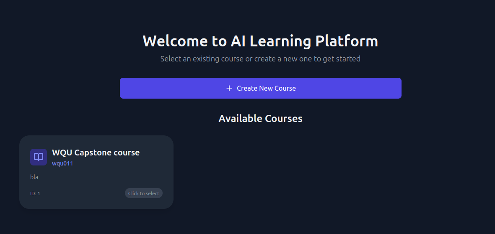
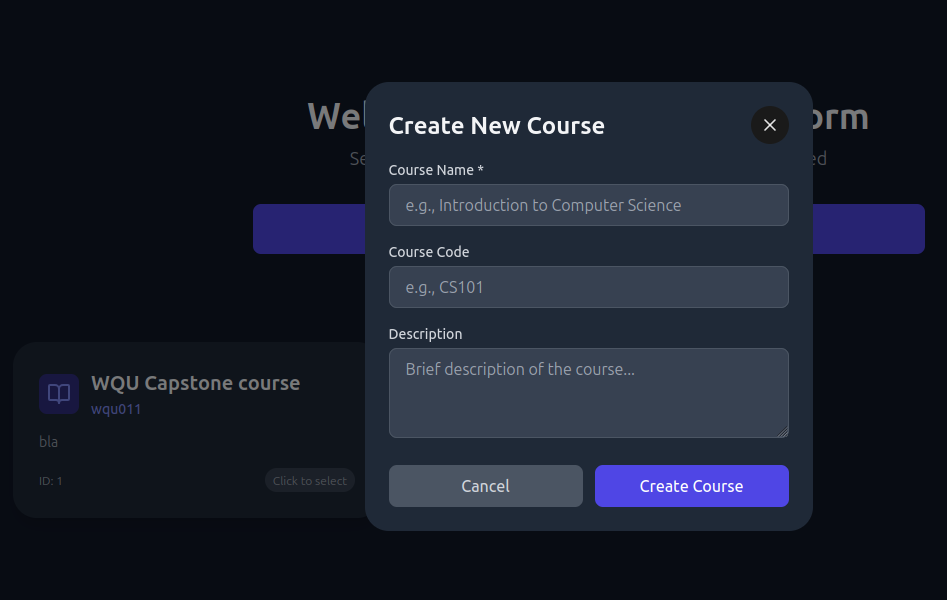
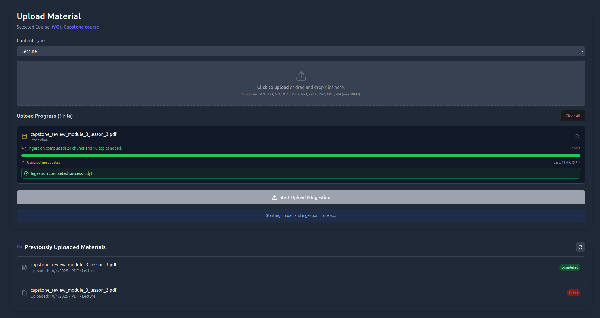
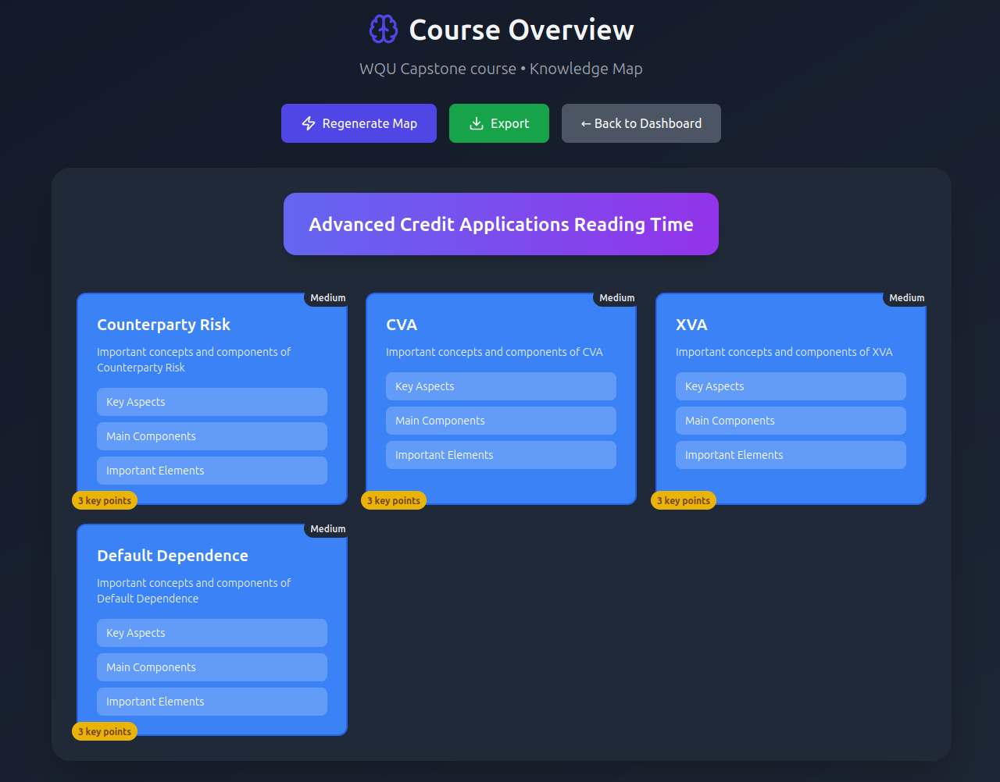
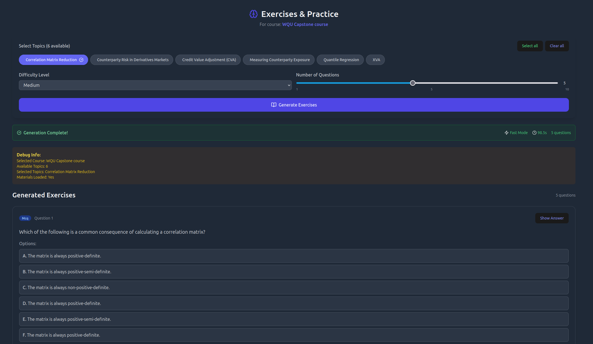
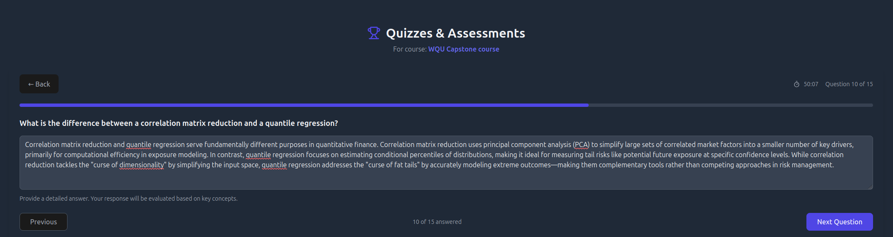
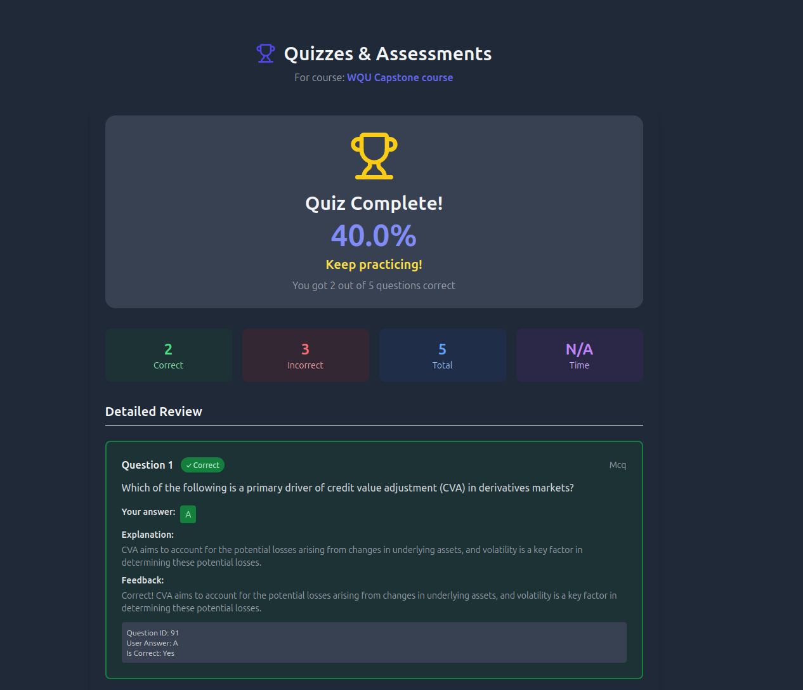
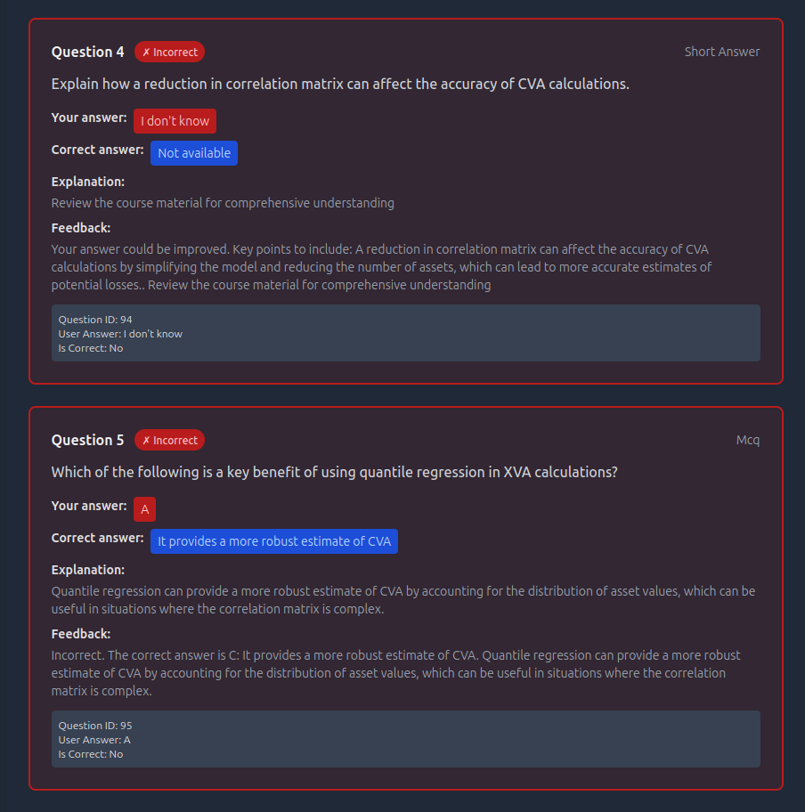

# AI Learning Platform

The **AI Learning PLATFORM** is a comprehensive, full-stack application designed to personalize learning using **Retrieval-Augmented Generation (RAG)** and dynamic content creation. It enables users to upload their own course materials and generate structured knowledge maps, personalized notes, and adaptive practice modules based on selected topics. Exercises are not graded. Quizzes have different modes to master the topics.

The entire application is built on a containerized microservice architecture, integrating a local Large Language Model (LLM), a vector database, and a relational database for offline access and maintaining privacy.

## Features

* **Course Selection & Creation:** The initial entry point allows users to select an existing course or create a new one to begin their learning journey.




* **Material Ingestion (RAG):** Users upload materials (PDF, markdown, text files, images, videos) to build a course-specific knowledge base. The content is automatically chunked, embedded, and stored in **Weaviate** for efficient retrieval.



* **Course Overview:** Generates and visualizes a **knowledge map** (a hierarchical structure of topics and subtopics) derived from the uploaded material.



* **Adaptive Practice:**
    * **Exercises** generates practice questions based on selected topics, difficulty levels, and the user's uploaded course content. 
    

    * **Quizzes:** Creates timed, structured exams for formal assessment and progress tracking.
    
    
    


## Technology Stack

This project is built using a multi-container architecture defined in `docker-compose.yml`.

### Frontend (Vite Project)

| Component | Technology |
| :--- | :--- |
| Framework | **React** (Vite Project) |
| Styling | **Tailwind CSS** |

### Backend (FastAPI)

| Component | Technology | Description |
| :--- | :--- | :--- |
| API Framework | **FastAPI** | High-performance, async Python web framework for the API. |
| RAG Orchestration | **Custom Python Code** | Used for document loading, chunking, and connecting the LLM to Weaviate. |
| Persistence | **PostgreSQL** | Relational database for storing user data, course metadata, and progress. |

### Infrastructure (Docker Compose)

| Service | Image/Purpose | Role |
| :--- | :--- | :--- |
| `backend` | Custom FastAPI | Application logic, orchestrates RAG and handles CRUD operations. |
| `weaviate` | `semitechnologies/weaviate` | **Vector Database** for storing and retrieving vectorized document chunks. |
| `postgres` | `postgres:15-alpine` | **Relational Database** for persistent course and user data. |
| `llm` | `llama.cpp` server | **Local LLM Server (Gemma)** for dynamic text generation. |
| `code-executor` | Custom Execution Env | Secure sandbox for executing and validating generated code. |

## Getting Started

### Prerequisites

You need to have **Docker** and **Docker Compose** installed on your system to run the application and its dependencies.

### 1\. Model Setup

The `llm` service is configured to run the **Gemma** model. You must place the specified GGUF model file inside the volume mounted to the LLM container.

1.  **Download the Model:** Download the specified GGUF model file (e.g., `gemma-3n-E2B-it-Q2_K.gguf`) from a trusted source, you can find plenty of suitable models on hugging face suitable for your GPU.

2.  **Create Directory:** Create the path expected by the `docker-compose.yml`:
    ```bash
    mkdir -p backend/llm/gemma3n
    ```

3.  **Place Model:** Place the downloaded `.gguf` file inside the `backend/llm/gemma3n` directory.

### 2\. Running the Application

1.  **Start Services:** Navigate to the root of the project directory and run:

    ```bash
    docker-compose up --build -d
    ```

    * This will build the custom `backend` image and start all five services (`backend`, `weaviate`, `postgres`, `llm`, `code-executor`).
    * **Note:** The LLM service requires GPU support and the `deploy` block in the YAML assumes an NVIDIA GPU is available.

2.  **Install Frontend Dependencies:** Navigate into the frontend directory:

    ```bash
    cd frontend
    npm install
    ```

3.  **Start Frontend:** Start the Vite development server:

    ```bash
    npm run dev
    ```

### 3\. Accessing the App

* **Frontend (UI):** Open your browser and navigate to `http://localhost:3000` (or the port specified by Vite).


## Core Workflow (Ingestion & Query)

The core RAG process is managed within the `backend/main.py` file, utilizing the clients in `rag/weaviate_client.py` and `llm/gemma_client.py`.

1.  **Ingestion:** User uploads a file (e.g., PDF) to a course.

2.  The file is passed to `rag/ingestion.py`.

3.  Documents are chunked using `SentenceSplitter`.

4.  Chunks are vectorized and stored in the **Weaviate** collection (Course name based).

5.  `weaviate_client.py` performs a **Hybrid Search** (vector + keyword) on Weaviate to retrieve the most relevant document chunks.

6.  The retrieved chunks are passed as **context** to `gemma_client.py`.

7.  `gemma_client.py` constructs a **RAG prompt** instructing the Gemma LLM to answer the user's question *only* using the provided context.

8.  The final, grounded answer is returned to the frontend.
